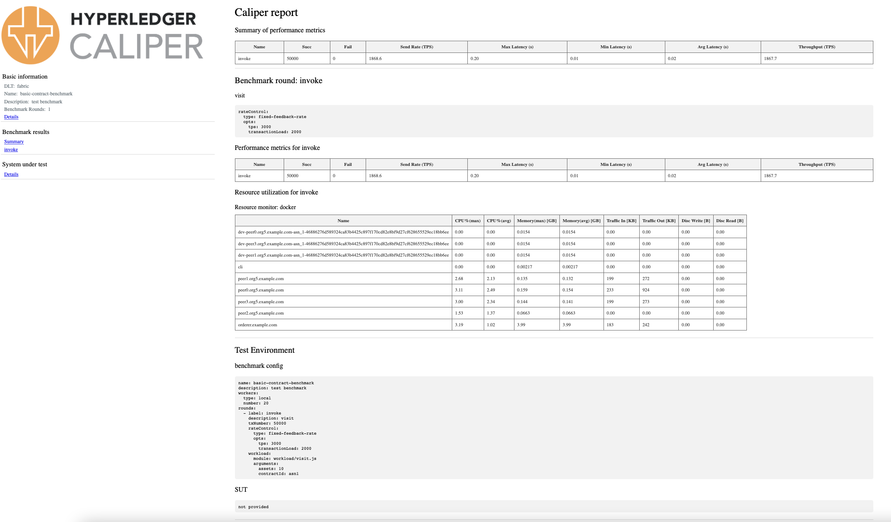

# Go-Sharing

**Go-Sharing: A Blockchain-based Privacy-Preserving Framework for Cross-Social Network Photo Sharing**

**Code Author:**

**[Updates]**

- 

### Demo

### Results


## Paper

## Abstract

Posting daily photos on online social network plat- forms (SNPs) has become a trend. Most SNPs adopt various security mechanisms to protect users’ privacy. Nevertheless, users’ privacy lacks adequate protection in cross-SNP sharing because most existing security mechanisms are only effective internally. These mechanisms are also vulnerable to tampering attacks from malicious uploaders. In addition, since the user’s privacy is completely dependent on the centralized server, a single point of failure will cause an irreparable privacy leakage problem. As a response, we propose a blockchain-based photo sharing framework called Go-sharing to protect users’ privacy under the multi-platform scenario. We develop a series of smart contract-based protocols to ensure secure photo sharing across different SNPs. To preserve the privacy of all owners in various SNPs, we hold a dissemination chain for every photo to record its entire spreading process and calculate a suitable policy for each propagation. Furthermore, a robust algorithm for ownership protection is also designed to resist tampering attacks, which binds each uploaded picture with its owner’s identity unbreakably. Our real-world dataset experiments on hyperledger Fabric 2.0 demonstrate that our proposed scheme is feasible and capable of resisting tampering attacks up to 40% of the tampered area.

## Platform

- HyperLedger Fabric 2.0
- HyperLedger Caliper0.4
- Docker
- CentOS
- Ubuntu

```
//链码 环境

//Ownership 环境
python                                       3.6.9
opencv-python                                4.1.2.20
numpy                                        1.18.2
matplotlib                                   3.1.2
PyWavelets                                   1.1.1
ImageHash                                    4.2.0
```


## Codes

There are three different section of this project.

1. Smart Contract
2. Ownership Protection 
3. Performance Assessment

We will go through the details in the following sections.

### 1. Smart Contract

In this section, we specify the algorithm for implementing the Go-sharing function in a blockchain-based cross-social network privacy image sharing framework, which consists of four main parts: image upload, image access or download, image forwarding or secondary upload, and image deletion.

1. We use development mode for testing

2. Upload Photo

   Require: Function name UploadPhoto, Photo owner OA, Social Network Platform SNP1, pointer of PA Pointer(PA), privacy policy , Ownership value of PA Ov(PA) ,Ownership of picture A 

   ```bash
   peer chaincode invoke -n mycc -c '{"Args":["UploadPhoto","OA","SNP1","PointerPA","v1-v2-v3-v4-v5*v1-v2-v3-v4*v1-v2-v3*v1-v2","OwnershipPA"]}' -C myc
   ```

3. Visit/Download Photo

   1. Require: Function name VishtPhoto, Photo visiter v2, Social Network Platform SNP2 for v2, Photo owner OA,Photo visiter v2, Social Network Platform SNP1 for v1,Ownership of picture A 

      ```bash
      peer chaincode invoke -n mycc -c '{"Args":["VisitPhoto","v2","SNP2","OA","OSN1","OwnershipPA"]}' -C myc
      ```

      Require: Function name DownloadPhoto, Photo visiter v2, Social Network Platform SNP2 for v2, Photo owner OA,Photo visiter v2, Social Network Platform SNP1 for v1,Ownership of picture A 

      ```bash
      peer chaincode invoke -n mycc -c '{"Args":["DownloadPhoto","OA","SNP1","OA","OSN1","OwnershipPA"]}' -C myc
      ```

   

4. Forword/Reupload Photo

   Require: Function name Forword/ReuploadPhoto, Photo visitor v2, Social Network Platform SNP3 for v2 , Privacy policy policy of v2 , Photo owner OA, Social Network Platform SNP1 for OA , Ownership of picture A 

   ```bash
   peer chaincode invoke -n mycc -c '{"Args":["ForwordPhoto","v2","SNP3","v1-v2-v3-v4-v5
   *v1-v2-v3-v4*v1-v2-v3*v1","OA","SNP1","OwnershipPA"]}' -C myc
   ```

5. Delete Photo

   Require: Function name DeletePhoto ,Photo owner OA, Social Network Platform SNP1, Ownership of picture A 

   ```bash
   peer chaincode invoke -n mycc -c '{"Args":["DeletePhoto","OA","SNP1","OwnershipPA"]}' -C myc
   ```


### 2. Ownership Protection 

There are three different section of this part.

1. Ownership Injection
2. Ownership Extraction
3. Photo Resizing and Compressing
4. Accuracy Comparison

#### 1. Ownership Injection

If you want test or do Ownership injection in a separate device or platform. Just download the file Ownership Protection.zip from the link:(这里把那个压缩包的github下载地址放进来)
Make sure the length of ownership sequence is 128 bits. 

##### Run ownership.py

```
# Injection
# For original photo and corresponding sequence of ownership protection, use the following command:

cd Ownership_Protection

python ownership.py original_photo_address inject ownership_sequence processed_photo_address
```

#### 2. Ownership Extraction

```
# Extraction
# For processed photo, use the following command:

cd Ownership_Protection

python ownership.py processed_photo_address extract

```

#### 3. Photo Resizing and Compressing

When you need to resize an image or test the compression resistance of our algorithm, you can use compress.py to transform images of any size and dimensions. 

##### Run compress.py

```
cd Ownership_Protection
# Check photo's size
# For the photos to be checked, use the following command:
python compress.py checksize Oimage_address

# Resize photo
#For the photos to be resized as (H,W), use the following command:
python compress.py resize Oimage_address outfile_address H W

#Compress photo
#For the photos to be Compressed to XX kb, use the following command:
python compress.py resize Oimage_address outfile_address XX quality
```

#### 4. Accuracy Comparison

Here, we give a detailed robustness test sample for ownership sequence extraction of images after various attacks including pretzel noise, Gaussian noise, rotation attack and tampering attack, and compare the extraction results in the form of one percentage with Whash similarity.

##### Run Comparison.py

```
cd Ownership_Protection
#compare the similarity of ownership sequence with Whash:
python Comparison.py picture1.address picture2.address
```

Note that picture2 here should be a variation of picture1.

#### demos:

| Origin Image                    | Size          | Ownership Sequence |
| ------------------------------- | ------------- | ------------------ |
|  | <center>750MB | <center>None       |

| Injected Image                    | Size          | Ownership Sequence                        |
| --------------------------------- | ------------- | ----------------------------------------- |
|  | <center>750KB | <center>aacc3c2a5c1a01474 48e7ed53b88aacc |

| Compressed Image                      | Size          | Ownership Sequence                        |
| ------------------------------------- | ------------- | ----------------------------------------- |
|  | <center>350KB | <center>aacc3c2a5c1a01474 48e7ed53b88aacc |

| Salt&Papper Noise                | Ownership Sequence                        | Accuracy        |
| -------------------------------- | ----------------------------------------- | --------------- |
|  | <center>aacc3c2a5c1a01474 48e7ed53b88aacc | <center>100.00% |

| Gaussian Noise                        | Ownership Sequence                        | Accuracy       |
| ------------------------------------- | ----------------------------------------- | -------------- |
|  | <center>aacc3c2a5c1a01474 48e7ed53b08aacc | <center>99.22% |

| Spin Attack                           | Ownership Sequence                        | Accuracy        |
| ------------------------------------- | ----------------------------------------- | --------------- |
|  | <center>aacc3c2a5c1a01474 48e7ed53b88aacc | <center>100.00% |

| Tampering Attack                    | Ownership Sequence                        | Accuracy        |
| ----------------------------------- | ----------------------------------------- | --------------- |
|  | <center>aacc3c2a5c1a01474 48e7ed53b88aacc | <center>100.00% |

### 3. Performance Assessment

We use HyperLedger caliper for performance assessment.



The configuration files we use in this project are as follows：

https://hyperledger.github.io/caliper/v0.4.2/installing-caliper/#using-the-docker-image

