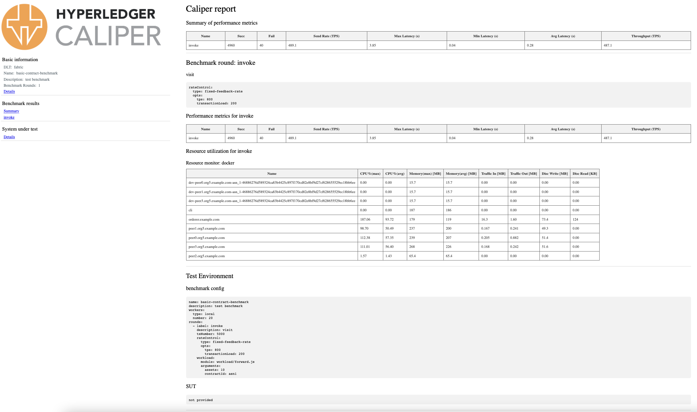

# Go-Sharing

**Go-Sharing: A Blockchain-based Privacy-Preserving Framework for Cross-Social Network Photo Sharing**

**Code Author: Ming Zhang Chunhao Zheng Yuhang Xie**

### Results


## Paper

## Abstract

With the evolution of social media, posting daily photos on online Social Network Platforms (SNPs) has become a trend. As a kind of sensitive privacy, online photos are often protected carefully by various security mechanisms. However, these mechanisms will lose effectiveness when someone spreads photos to other platforms. In this paper, we propose Go-sharing, a blockchain-based privacy-preserving framework that provides powerful dissemination control for cross-SNPs photo sharing. In contrast to existing security mechanisms that run separately in centralized servers which hardly create trust between each other, our framework achieves consistent consensus on photo dissemination control through carefully designed smart contract-based protocols. By utilizing these protocols, we create platform-free dissemination trees for every sharing image, providing users with complete sharing control and privacy protection. Considering the possible privacy conflicts between photo owners and subsequent re-posters in cross-SNPs sharing, we design a dynamic privacy policy generation algorithm to maximize the flexibility of subsequent re-posters without violating formers’ privacy. Moreover, Go-sharing also provides robust photo ownership identification mechanisms to avoid illegal reprinting and theft of photos. It introduces a random noise black box in two-stage separable deep learning (TSDL) to improve the robustness against unpredictable manipulations. The proposed framework is evaluated through extensive real-world simulations. The results show the capability and effectiveness of Go-Sharing based on a variety of performance metrics.

## Platform

- HyperLedger Fabric
- Hyperledger Caliper
- Docker
- CentOS
- Ubuntu

``` 
//Smart Contract
docker-ce                                    19.04
docker-compose                               19.03.13
nodejs                                       10.20.0
npm                                          6.14.4
HyperLedger Fabric                           2.0
Hyperledger Caliper                          0.4
CentOS                                       7.9.2

//Ownership
python                                       3.6.9
opencv-python                                4.1.2.20
numpy                                        1.18.2
matplotlib                                   3.1.2
PyWavelets                                   1.1.1
ImageHash                                    4.2.0
```

## Codes

There are three different section of this project.

1. Smart Contract
2. Ownership Protection
3. Performance Assessment

We will go through the details in the following sections.

### 1. Smart Contract

In this section, we specify the algorithm for implementing the Go-sharing function in a blockchain-based cross-social network privacy image sharing framework, which consists of four main parts: image upload, image access or download, image forwarding or secondary upload, and image deletion.

#### Start Network

##### Generate cryptography files

```bash
../bin/cryptogen generate --config=./crypto-config.yaml
export FABRIC_CFG_PATH=$PWD
mkdir channel-artifacts
../bin/configtxgen -profile SampleMultiNodeEtcdRaft -outputBlock ./channel-
artifacts/genesis.block -channelID byfn-sys-channel
../bin/configtxgen -profile TwoOrgsChannel -outputCreateChannelTx ./channel-
artifacts/channel.tx -channelID mychannel
../bin/configtxgen -profile TwoOrgsChannel -outputAnchorPeersUpdate
./channel-artifacts/Org1MSPanchors.tx -channelID mychannel -asOrg Org1MSP
../bin/configtxgen -profile TwoOrgsChannel -outputAnchorPeersUpdate
./channel-artifacts/Org2MSPanchors.tx -channelID mychannel -asOrg Org2MSP
../bin/configtxgen -profile TwoOrgsChannel -outputAnchorPeersUpdate
./channel-artifacts/Org3MSPanchors.tx -channelID mychannel -asOrg Org3MSP
```

##### Create a Genesis Block

```bash
docker exec cli peer channel create -o orderer.example.com:7050 -c mychannel
\
       -f ./channel-artifacts/channel.tx --tls true \
--cafile
/opt/gopath/src/github.com/hyperledger/fabric/peer/crypto/ordererOrganizatio
ns/example.com/orderers/orderer.example.com/msp/tlscacerts/tlsca.example.com
-cert.pem
```

##### Add each peer to the channel

```bash
docker exec -it cli bash
ORDERER_CA=/opt/gopath/src/github.com/hyperledger/fabric/peer/crypto/orderer Organizations/example.com/orderers/orderer.example.com/msp/tlscacerts/tlsca. example.com-cert.pem
peer channel create -o orderer.example.com:7050 -c mychannel -f ./channel- artifacts/channel.tx --tls true --cafile $ORDERER_CA
mv mychannel.block channel-artifacts/
peer channel join -b channel-artifacts/mychannel.block
source scripts/utils.sh
setGlobals 1 1
peer channel join -b channel-artifacts/mychannel.block
```

##### Install and package the chain code

```bash
peer lifecycle chaincode package asn.tar.gz --path
/opt/gopath/src/github.com/chaincode/ASN/ --lang golang --label asn_1
peer lifecycle chaincode install asn.tar.gz
go mod vendor
peer lifecycle chaincode queryinstalled
peer lifecycle chaincode approveformyorg --tls true \
 --cafile
/opt/gopath/src/github.com/hyperledger/fabric/peer/crypto/ordererOrganizatio
ns/example.com/orderers/orderer.example.com/msp/tlscacerts/tlsca.example.com
-cert.pem \
 --channelID mychannel --name asn --version 1 --init-required --package-id
asn_1:ecc7f631316aca386589cf57cb4b1c312981cea9bce29a11cd4b6297703daf02 --
sequence 1 --waitForEvent
peer lifecycle chaincode checkcommitreadiness --channelID mychannel --name
asn  --version 1 --sequence 1 --output json --init-required
source /scripts/utils.sh
setGlobals 0 2
peer lifecycle chaincode commit -o orderer.example.com:7050 \
 --tls true --cafile
/opt/gopath/src/github.com/hyperledger/fabric/peer/crypto/ordererOrganizatio
ns/example.com/orderers/orderer.example.com/msp/tlscacerts/tlsca.example.com
-cert.pem \
 --channelID mychannel --name asn --peerAddresses
peer0.org1.example.com:7051 \
 --tlsRootCertFiles
/opt/gopath/src/github.com/hyperledger/fabric/peer/crypto/peerOrganizations/
org1.example.com/peers/peer0.org1.example.com/tls/ca.crt \
 --peerAddresses peer0.org2.example.com:7051 --tlsRootCertFiles
/opt/gopath/src/github.com/hyperledger/fabric/peer/crypto/peerOrganizations/
org2.example.com/peers/peer0.org2.example.com/tls/ca.crt \
 --peerAddresses peer0.org3.example.com:7051 --tlsRootCertFiles
/opt/gopath/src/github.com/hyperledger/fabric/peer/crypto/peerOrganizations/
org3.example.com/peers/peer0.org3.example.com/tls/ca.crt \
 --version 1 --sequence 1 --init-required
```

#### Execution of commands

1. We use development mode for testing
2. Upload Photo

   Require: Function name UploadPhoto, Photo owner OA, Social Network Platform SNP1, pointer of PA Pointer(PA), privacy policy , Ownership value of PA Ov(PA) ,Ownership of picture A

   ```bash
   peer chaincode invoke -n mycc -c '{"Args":["UploadPhoto","OA","SNP1","PointerPA","v1-v2-v3-v4-v5*v1-v2-v3-v4*v1-v2-v3*v1-v2","OwnershipPA"]}' -C myc
   ```
3. Visit/Download Photo

   Require: Function name VishtPhoto, Photo visiter v2, Social Network Platform SNP2 for v2, Photo owner OA,Photo visiter v2, Social Network Platform SNP1 for v1,Ownership of picture A

   ```bash
   peer chaincode invoke -n mycc -c '{"Args":["VisitPhoto","v2","SNP2","OA","OSN1","OwnershipPA"]}' -C myc
   ```

   Require: Function name DownloadPhoto, Photo visiter v2, Social Network Platform SNP2 for v2, Photo owner OA,Photo visiter v2, Social Network Platform SNP1 for v1,Ownership of picture A

   ```bash
   peer chaincode invoke -n mycc -c '{"Args":["DownloadPhoto","OA","SNP1","OA","OSN1","OwnershipPA"]}' -C myc
   ```
4. Forword/Reupload Photo

   Require: Function name Forword/ReuploadPhoto, Photo visitor v2, Social Network Platform SNP3 for v2 , Privacy policy policy of v2 , Photo owner OA, Social Network Platform SNP1 for OA , Ownership of picture A

   ```bash
   peer chaincode invoke -n mycc -c '{"Args":["ForwordPhoto","v2","SNP3","v1-v2-v3-v4-v5
   *v1-v2-v3-v4*v1-v2-v3*v1","OA","SNP1","OwnershipPA"]}' -C myc
   ```
5. Delete Photo

   Require: Function name DeletePhoto ,Photo owner OA, Social Network Platform SNP1, Ownership of picture A

   ```bash
   peer chaincode invoke -n mycc -c '{"Args":["DeletePhoto","OA","SNP1","OwnershipPA"]}' -C myc
   ```

### 2. Ownership Protection


#### 0. Data set

To implement the proposed ownership identification scheme, We use 100,000 and 1000 images from the COCO data set for model training and testing, respectively.

#### 1. Train encoder

**Encoder**. The encoder is trained to mask the first up- loaded origin photo with a given ownership sequence as a watermark. In the encoder, the ownership sequence is first duplicate concatenated to expanded into a 3-dimension tesnor −1, 1L∗H ∗Wand concatenated to the encoder ’s intermediary representation. Since the watermarking based on a convolutional neural network uses the different levels of feature information of the convoluted image to learn the unvisual watermarking injection, this 3-dimension tenor is repeatedly used to concatenate to every layer in the encoder and generate a new tensor ∈ R(C+L)∗H∗W for the next layer. After multiple convolutional layers, the encode produces the encoded image Ien. To ensure the availability of the encoded image, the encoder should training to minimize the distance between Iop and Ien:

$$
LE =MSE(Iop,Ien)=MSE(Iop,E(Iop,Oin))
$$

and the probability to be detected an encoded image by the adversarial discriminator A:

$$
LG = log (1 − A(Ien))
$$

##### Run main.py

```bash
cd Ownership_Protection
python main.py
```

#### 2. Train Decoder

**Decoder**. The decoder consists of several convolutional layers, a global spatial average pooling layer, and a single linear layer, where convolutional layers are used to produce L feature channels while the average pooling converts them into the vector of the ownership sequence’s size. Finally, the single linear layer produces the recovered ownership sequence Oout. It should be noted that the distribution of the recovered sequence indicates whether the image is encoded. If the Oout ∈ {0, 1}L rather than {−1, 1}L , we say that this image is in its first uploading. To ensure the availability of the recovered ownership sequence, the decoder should training to minimize the distance between Oin and Oout:

$$
LD = MSE(Oin, Oout) = MSE(Oin, D(Oin))
$$

```bash
cd Ownership_Protection
python main_for_decode.py
```

#### 3. Adversary Discriminator

**Adversary Discriminator**. The adversary discriminator has a similar structure to the decoder and outputs a binary classification. Acting as a critical role in the adversarial network, the adversary attempts to classify Ien from Iop cor- rectly to prompt the encoder to improve the visual quality of Ien until it is indistinguishable from Iop. The adversary should training to minimize the following:

$$
LA = log (1 − A(Iop)) + log (A(E(Iop)))
$$

##### test_model.py

```bash
cd Ownership_Protection
python test_model.py
```

#### 4. Random noise black box

**Random noise black box**. In blind watermarking, recent  works are often trained with fixed types of noise and parameters [39], [40]. Such models only work well for identical noise attacks while performing poorly against unpredictable random noise combinations attacks. Unfortunately, in cross-SNPs sharing, photos are often subject to more than one type of unknown noise attack. Hence, to improve robustness, we design a random noise black box to simulate the unpre- dictable modifications during photo dissemination. Given an Ien as input, the random noise black box selects 0∼3 types of processing as black-box noise attacks from Resize, Gaussian noise, Brightness&Contrast, Crop, and Padding to output the noised image Ino. Note that in addition to the type and the amount of noise, the intensity and parameters of the noise are also randomized to ensure the model we trained can handle any combination of noise attacks.

you can edit Noise.py

#### result:


### 3. Performance Assessment

We use HyperLedger caliper for performance assessment.

 [upload.html](https://github.com/Mirecle/Go-Sharing/blob/main/Performance%20Assessment/result/upload.html) （You can download the html file and open it locally with your browser）


 [visit.html](https://github.com/Mirecle/Go-Sharing/blob/main/Performance%20Assessment/result/visit.html)


 [forward.html](https://github.com/Mirecle/Go-Sharing/blob/main/Performance%20Assessment/result/forward.html)



 [delete.html](https://github.com/Mirecle/Go-Sharing/blob/main/Performance%20Assessment/result/delete.html)


The configuration files we use in this project are as follows：

https://hyperledger.github.io/caliper/v0.4.2/installing-caliper/#using-the-docker-image
